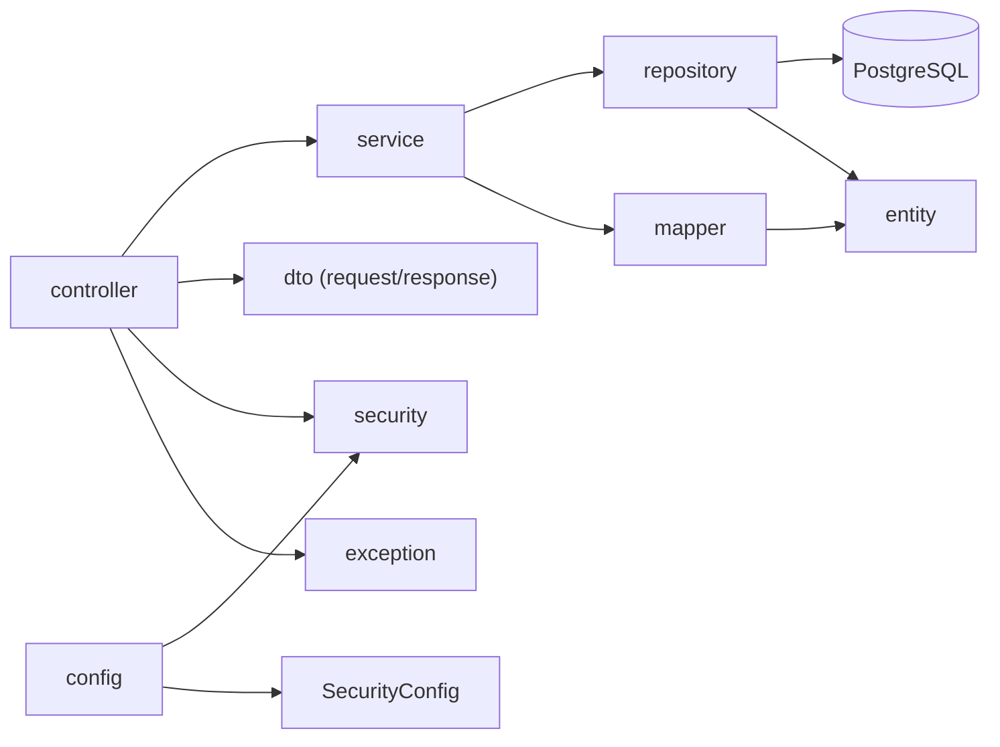

# Backend Architecture

## Sơ đồ cây thư mục

```
src
├───main
│   ├───java
│   │   └───com
│   │       └───tuan
│   │           └───course_management
│   │               │   CourseManagementApplication.java
│   │               │
│   │               ├───config
│   │               │       DataInitializer.java
│   │               │       SecurityConfig.java
│   │               │
│   │               ├───controller
│   │               │       AuthController.java
│   │               │       CourseController.java
│   │               │       EnrollmentController.java
│   │               │       LessonController.java
│   │               │       NotificationController.java
│   │               │       ReportController.java
│   │               │       ReviewController.java
│   │               │       UserController.java
│   │               │
│   │               ├───dto
│   │               │   ├───request
│   │               │   │       ChangePasswordRequest.java
│   │               │   │       CourseCreateRequest.java
│   │               │   │       CourseUpdateRequest.java
│   │               │   │       CreateUserRequest.java
│   │               │   │       EnrollmentRequest.java
│   │               │   │       LessonRequest.java
│   │               │   │       LoginRequest.java
│   │               │   │       NotificationRequest.java
│   │               │   │       RegisterRequest.java
│   │               │   │       ReviewRequest.java
│   │               │   │       UpdateCourseStatusRequest.java
│   │               │   │       UpdateRoleRequest.java
│   │               │   │       UpdateStatusRequest.java
│   │               │   │       UpdateUserRequest.java
│   │               │   │
│   │               │   └───response
│   │               │       │   ApiResponse.java
│   │               │       │   CourseDetailResponse.java
│   │               │       │   CourseResponse.java
│   │               │       │   EnrollmentDetailResponse.java
│   │               │       │   EnrollmentResponse.java
│   │               │       │   JwtResponse.java
│   │               │       │   LessonProgressResponse.java
│   │               │       │   LessonResponse.java
│   │               │       │   NotificationResponse.java
│   │               │       │   PageResponse.java
│   │               │       │   ReviewResponse.java
│   │               │       │   TopCourseResponse.java
│   │               │       │   UserResponse.java
│   │               │       │
│   │               │       └───report
│   │               │               StudentProgressResponse.java
│   │               │               TeacherOverviewResponse.java
│   │               │
│   │               ├───entity
│   │               │       Course.java
│   │               │       Enrollment.java
│   │               │       Lesson.java
│   │               │       LessonProgress.java
│   │               │       Notification.java
│   │               │       Review.java
│   │               │       User.java
│   │               │
│   │               ├───enums
│   │               │       CourseStatus.java
│   │               │       Role.java
│   │               │
│   │               ├───exception
│   │               │       AppException.java
│   │               │       ErrorCode.java
│   │               │       GlobalExceptionHandler.java
│   │               │
│   │               ├───mapper
│   │               │       CourseMapper.java
│   │               │       EnrollmentMapper.java
│   │               │       LessonMapper.java
│   │               │       NotificationMapper.java
│   │               │       ReviewMapper.java
│   │               │       UserMapper.java
│   │               │
│   │               ├───repository
│   │               │       CourseRepository.java
│   │               │       EnrollmentRepository.java
│   │               │       LessonProgressRepository.java
│   │               │       LessonRepository.java
│   │               │       NotificationRepository.java
│   │               │       ReviewRepository.java
│   │               │       UserRepository.java
│   │               │
│   │               ├───security
│   │               │       CustomUserDetailsService.java
│   │               │       JwtAccessDeniedHandler.java
│   │               │       JwtAuthenticationEntryPoint.java
│   │               │       JwtAuthenticationFilter.java
│   │               │       JwtProvider.java
│   │               │       UserPrincipal.java
│   │               │
│   │               ├───service
│   │               │       AuthService.java
│   │               │       CourseService.java
│   │               │       EnrollmentService.java
│   │               │       LessonService.java
│   │               │       NotificationService.java
│   │               │       ReportService.java
│   │               │       ReviewService.java
│   │               │       UserService.java
│   │               │
│   │               └───util
│   │                       PageUtils.java
│   │
│   └───resources
│       │   application-dev.properties
│       │   application-local.properties
│       │   application-prod.properties
│       │   application.properties
│       │   logback-spring.xml
│       │
│       ├───static
│       └───templates
└───test
    ├───generated_tests
    └───java
        └───com
            └───tuan
                └───course_management
                        CourseManagementApplicationTests.java
```

## Kiến trúc thư mục theo tầng



## Mô tả các tầng

| Tầng       | Package      | Vai trò                                             |
|------------|--------------|-----------------------------------------------------|
| Controller | `controller` | Nhận request HTTP, gọi service, trả response        |
| DTO        | `dto`        | Định nghĩa dữ liệu vào/ra giữa client và server     |
| Service    | `service`    | Xử lý nghiệp vụ chính                               |
| Mapper     | `mapper`     | Chuyển đổi giữa Entity và DTO                       |
| Repository | `repository` | Truy vấn dữ liệu (Spring Data JPA)                  |
| Entity     | `entity`     | Ánh xạ bảng trong database                          |
| Security   | `security`   | Xác thực/phân quyền bằng JWT                        |
| Exception  | `exception`  | Xử lý lỗi tập trung, chuẩn hóa response lỗi         |
| Config     | `config`     | Cấu hình Spring Security, khởi tạo dữ liệu mặc định |
